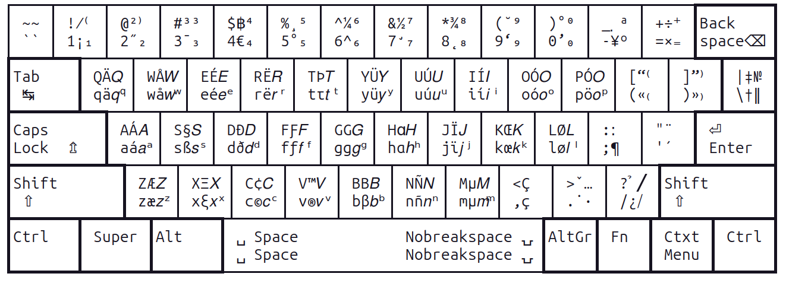

# MathLingua-Layout: An XKB Keyboard Layout for Math-Symbol Typing Polyglots

Welcome to the MathLingua-Layout repository. This project is dedicated to providing a unique keyboard layout tailored for Linux (and *nix) users, specifically for the XKB system. Our layout is designed to bridge the gap between mathematical typing, multi-lingual capabilities, and the familiarity of the standard US keyboard layout.

## The Problem

While numerous keyboard layouts are optimized for polyglot European users, especially those from Western Europe, many of these layouts deviate from the standard US keyboard. This deviation often requires users to unlearn and relearn key placements, leading to inefficiencies and frustrations. Furthermore, many existing keyboards offer mathematical capabilities but lack multi-lingual support, such as typing in Italian. This limitation is particularly glaring given Italy's rich history as the birthplace of European mathematics during the Renaissance.

## The Solution

MathLingua-Layout is our answer to these challenges. At its core, it retains the intuitive design of the US keyboard, ensuring that users don't have to unlearn anything. Every symbol and letter functions exactly like the US keyboard. However, it goes beyond by offering up to seven levels of key functions, allowing for a vast array of symbols and characters. This is a significant enhancement over most layouts, which typically offer a maximum of four levels.

## Introduction

This layout is a modification of the "English (intl., with AltGr dead keys)" keyboard layout, originally developed by Microsoft. It's optimized for typing mathematical symbols and expressions without compromising the original layout's multi-lingual capabilities[^microsoft]. The layout is designed as a diff file against the `/usr/share/X11/xkb/symbols/us` file that comes with Ubuntu, replacing the "English (intl., with AltGr dead keys)" layout directly. The repository is updated with every Ubuntu LTS release.

[^microsoft]: The "English (intl., with AltGr dead keys)" layout, originally developed by Microsoft, enables typing in virtually any Latin-based script. It is specifically optimized for Spanish and French, designed to minimize the use of dead keys. Only a few words, such as "bilingüe" (bilingual in Spanish), require the use of dead keys. 

## Features

- **No unlearning**: No symbol changed from the popular US English QWERTY layout.
- **No use of dead keys for many European languages**: If you type English, Spanish, German, Swedish, Danish, Norwegian or Icelandic, you don't need to use dead keys. Other languages, such as French, still need dead keys.
- **Seven-Level Keyboard**: Most keys can produce up to seven distinct symbols organized into four columns.
- **Currencies**: Enhanced currency support including the Euro (€) and Bitcoin (₿) symbols.
- **Greek Letters**: Incorporates frequently used Greek letters like α and ξ, more to come.
- **Italic Letters**: Introduces an Italic variant for every English alphabet letter, represented in Unicode. Used in "let 𝑥 be 0".
- **Subscript & Superscript**: Offers superscript digits, letters, and operators, plus subscript digits.
- **Additional Symbols**: Incorporates a range of symbols from slashes to note symbols, catering to diverse typing needs.

This is a seven-level keyboard, meaning that each key on the keyboard can produce up to seven symbols.

These symbols are organized into four columns, in this chart:



| Level | Modifier Combination      | Symbols Produced    | With the example of letter A |
| ----- | ------------------------- | ------------------- | ------------------- |
| 1     | Direct Press              | First Column lower| a |
| 2     | Shift                     | First Column upper | A |
| 3     | AltGr                     | Second Column lower | á |
| 4     | AltGr + Shift             | Second Column upper | Á |
| 5     | Super (e.g., Windows Key) | Third Column lower | 𝑎 |
| 6     | Super + Shift             | Third Column upper | 𝐴 |
| 7     | Super + AltGr             | Forth Column lower | ᵃ |
| 8     | Super + AltGr + Shift     | Not Defined. No one likes pressing 4 keys together| |

## Usage

This table only covers the usage of additions to The "English (intl., with AltGr dead keys)" layout.

| Symbol Name                  | How to Type Them                      | Examples                                                           |
|-----------------------------|---------------------------------------|---------------------------------------------------------------------|
| Euro Sign (€)               | <kbd>AltGr</kbd> + <kbd>4</kbd>         | "The price is €50."                                                  |
| Bitcoin (₿)                 | <kbd>AltGr</kbd> + <kbd>Shift</kbd> + <kbd>4</kbd> | "The current value of Bitcoin is ₿1 = $40,000."                       |
| Greek Letters (α, ξ)        | (Based on key mapping)                | "The angle α is 60°." "The variable ξ represents..."                  |
| Italic Letters (e.g., 𝑛)    | <kbd>Super</kbd> + [letter]           | "Let 𝑛 be the number of elements."                                   |
| Subscript Digits            | <kbd>Super</kbd> + [digit]            | "The chemical formula is H₂O."                                       |
| Superscript Numbers (e.g., ⁴)| <kbd>Shift</kbd> + <kbd>Super</kbd> + [digit] | "The value is 𝑥⁴."                                                   |
| Superscript Letters         | <kbd>Shift</kbd> + <kbd>Super</kbd> + [letter] | "The variable 𝑦ᵃ represents..."                                      |
| Fractional Slash (⁄)        | <kbd>AltGr</kbd> + <kbd>Shift</kbd> + <kbd>1</kbd> | "The ratio is 1⁄4." "The fraction 1⁄7 represents..."                    |
| Big Solidus (⧸)        | <kbd>Super</kbd> + <kbd>/</kbd> | "Business Profile꞉ P⧸U Pty Ltd.pdf" (replaces slash in filenames)                    |
| Modifier Letter Colon (꞉)        | <kbd>AltGr</kbd> + <kbd>;</kbd> | "Business Profile꞉ P⧸U Pty Ltd.pdf" (replaces colon in filenames)                 |
| Note Symbols† (†, ‡, §, ‖, ¶)| (Based on key mapping)                | "Refer to the note†." "See the section‡." "Paragraph starts with¶."  |
| Numero Symbol (№)          | <kbd>Super</kbd> + <kbd>Shift</kbd> + <kbd>\\</kbd> | "Product №12345."                                                    |
| Cardinal Signs (º, ª)       | <kbd>Super</kbd> + <kbd>-</kbd> and <kbd>Super</kbd> + <kbd>Shift</kbd> + <kbd>-</kbd> | "1º lugar." "2ª posición."                                          |
| Degree Sign (°)             | <kbd>AltGr</kbd> + <kbd>5</kbd>                | "The temperature is 25°." "Calle Mayor 10°, Madrid."                 |
| Registered Trademark (®) and Trademark (™) | <kbd>AltGr</kbd> + <kbd>v</kbd>, <kbd>AltGr</kbd> + <kbd>Shift</kbd> + <kbd>v</kbd>                |  Enron®'s NewProduct™              |

† **Note Symbols**: The first four traditional order of [note symbols](https://en.wikipedia.org/wiki/Note_(typography)) in English have been added. The traditional order of these symbols in English is [*](https://en.wikipedia.org/wiki/Asterisk), [†](https://en.wikipedia.org/wiki/Dagger_(typography)), [‡](https://en.wikipedia.org/wiki/Double_dagger_(typography)), [§](https://en.wikipedia.org/wiki/Section_sign), [‖](https://en.wikipedia.org/wiki/Vertical_Bar), [¶](https://en.wikipedia.org/wiki/Pilcrow). The first exists on standard keyboards, the section sign § and the pilcrow sign ¶ existed in "English (intl., with AltGr dead keys)", this project piles the rest three symbols on the backslash key.

## Installation

For Ubuntu 23.04:
1. Replace `/usr/share/X11/xkb/symbols/us` with `ubuntu-23.04.us`.
2. In X11, select the "English (intl., with AltGr dead keys)" layout.
3. For Wayland users, configure the layout within your Wayland compositor settings.

This layout supersedes the original "English (intl., with AltGr dead keys)". While a dedicated OS package would be ideal, none currently exists. For other Linux versions or X11, apply `ubuntu-23.04.diff` to `/usr/share/X11/xkb/symbols/us` using the patch command.

This is done by first going into the directory, then run patch with the input being the diff file corrisponding to your Linux distribution, or the version most near to it. Try a dry run first:

    $ cd /usr/share/X11/xkb/symbols
    $ sudo patch --dry-run --force < ~/code/MathLingua-Layout/ubuntu-23.04.diff

After the dry run, if it shows no errors, do a real run:

    $ sudo patch --force < ~/code/MathLingua-Layout/ubuntu-23.04.diff

Once this is done, don't forget to go to Gnome Settings, choose Keyboard and choose "English (intl., with AltGr dead keys)".

There are [additional instructions](SMALL-KEYBOARDS.md) if you need a special configuration for small keyboards.

## Known Issues

While the layout aims to enhance the typing experience, there are a few known issues and areas for potential improvement:

- **Superscript Minus**: Currently, there is no superscript minus symbol because muscular and feminine cardinal is where you would expect superscript minus. This is rarely an issue as superscripts are often used for elliptic curve math, which primarily involves addition.
- **Unused Alt Key Combinations**: The combinations `alt+g`, `alt+shift+g` and `alt+m` and `alt+shift+m` currently do not produce any special symbols.
- **Insufficient Greek letters**. One suggestion was that there should be enough Greek letters to denote the SARS-CoV-2 variants, but there were just too many.

These issues will be considered for future updates and improvements.

## It's a feature, not a bug

- Superscript `o` **ᵒ**, and superscript `a` **ᵃ** can be used for muscular and feminine cardinal **º** and **ª**, so having all of them on a keyboard layout appears over-designed. However, cardinal numbers have underscores in certain fonts; they are visually not replaceable for each other. People who speak Spanish or Portuguese can tell.
- Degree Sign: Several symbols resemble the Degree Sign. The authentic Degree Sign is located on the number key 5. Pressing <kbd>Alt</kbd>+<kbd>shift</kbd>+<kbd>0</kbd> twice produces the symbol °, which closely resembles the Degree Sign. However, it's the circle atop the letter Ů. While the muscular cardinal sign and the superscript letter `o` may also appear similar to the Degree Sign, they serve different functions.
- Usually, capital N followed by muscular cardinal º, when typed together like this Nº, suffices as a substitute for Numero sign №. We kept both anyway.
- The Latin Alpha (ɑ) and Copyright (©) symbols have little real-life uses. Pity.

## Helpful Knowledge

To get the Unicode point of a character, use this command:
````
echo -n "𐞥" | iconv -f utf8 -t UTF-32 | hexdump -e '/2 "U+%04X\n"'
U+FEFF
U+0000
U+07A5
U+0001
````
This shows that 𐞥 is U107A5. You can use this trick to get the unicode codepoint for everything mentioned in this document.
